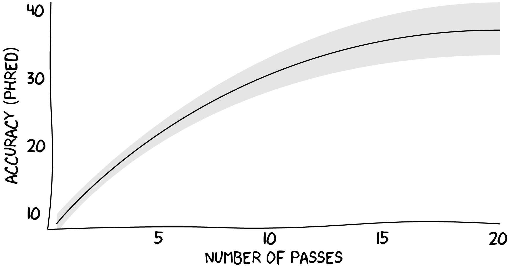
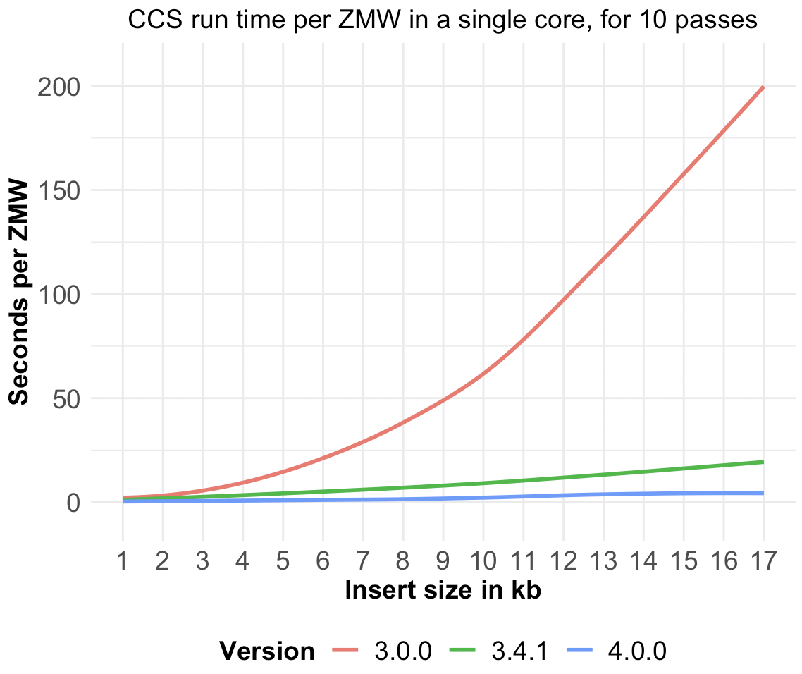

<p align="center">
  
</p>
<h1 align="center">CCS</h1>
<p align="center">Generate Highly Accurate Single-Molecule Consensus Reads</p>

***

_ccs_ takes multiple (sub)reads of the same SMRTbell molecule and combines
them using a statistical model to produce one highly accurate consensus sequence,
also called HiFi or CCS read, with base quality values.
This tool powers the _Circular Consensus Sequencing_ workflow in SMRT Link.

## Availability
Latest `ccs` can be installed via bioconda package `pbccs`.

Please refer to our [official pbbioconda page](https://github.com/PacificBiosciences/pbbioconda)
for information on Installation, Support, License, Copyright, and Disclaimer.

## Latest Version
Version **4.0.0**: [Full changelog here](#changelog)

## Schematic Workflow
<p align="center"></p>

## Execution
**Input**: Subreads from a single movie in PacBio BAM format (`.subreads.bam`).

**Output**: Consensus reads in a format inferred from the file extension:
unaligned BAM (`.bam`); bgzipped FASTQ (`.fastq.gz`);
or SMRT Link XML (`.consensusreadset.xml`) which also generates a corresponding
BAM file.

Run on a full movie:

    ccs movie.subreads.bam movie.ccs.bam

Parallelize by using `--chunk`.
See [how-to chunk](#how-can-I-parallelize-on-multiple-servers).

## FAQ

### What impacts the number and quality of CCS reads that are generated?
The longer the polymerase read gets, more readouts (passes) of the SMRTbell
are produced and consequently more evidence is accumulated per molecule.
This increase in evidence translates into higher consensus accuracy, as
depicted in the following plot:

<p align="center"></p>

### How is number of passes computed?
Each CCS read is annotated with a `np` tag that contains the number of
full-length subreads used for polishing.
Since the first version of _ccs_, number of passes has only accounted for
full-length subreads. In version v3.3.0 windowing has been added, which
takes the minimum number of full-length subreads across all windows.
Starting with version v4.0.0, minimum has been replaced with mode to get a
better representation across all windows.

### Which and in what order are filters applied?
_ccs_ exposes the following filters on input subreads, draft consensus,
and final output consensus:

    Input Filter Options:
      --min-passes   INT    Minimum number of full-length subreads required to generate CCS for a ZMW. [3]
      --min-snr      FLOAT  Minimum SNR of subreads to use for generating CCS [2.5]

    Draft Filter Options:
      --min-length   INT    Minimum draft length before polishing. [10]
      --max-length   INT    Maximum draft length before polishing. [50000]

    Output Filter Options:
      --min-rq       FLOAT  Minimum predicted accuracy in [0, 1]. [0.99]

Data flow how each ZMW gets processed and filtered:
1. Remove subreads with lengths <50% or >200% of the median subread length.
2. Remove subreads with SNR below `--min-snr`.
3. Stop if number of full-length subreads is fewer than `--min-passes`.
4. Generate draft sequence and stop if draft length does not pass `--min-length` and `--max-length`.
5. Polish consensus sequence and only emit CCS read if predicted accuracy is at least `--min-rq`.

### How do I read the ccs_report.txt file?
The `ccs_report.txt` file summarizes (B) how many ZMWs generated CCS reads and
(C) how many failed CCS generation because of the listed causes. For (C), each ZMW
contributes exactly to one reason of failure; percentages are with respect to (C).

The following comments refer to the filters that are explained in the FAQ above.

    ZMWs input          (A)  : 4779
    ZMWs generating CCS (B)  : 1875 (39.23%)
    ZMWs filtered       (C)  : 2904 (60.77%)

    Exclusive ZMW counts for (C):
    No usable subreads       : 66 (2.27%)     <- All subreads were filtered in (1)
    Below SNR threshold      : 54 (1.86%)     <- All subreads were filtered in (2)
    Lacking full passes      : 2779 (95.70%)  <- Less than --min-passes full-length reads (3)
    Heteroduplexes           : 0 (0.00%)      <- Single-strand artifacts
    Min coverage violation   : 0 (0.00%)      <- ZMW is damaged on one strand and can't be polished reliably
    Draft generation error   : 5 (0.17%)      <- Subreads don't agree to generate a draft sequence
    Draft above --max-length : 0 (0.00%)      <- Draft sequence is longer than --min-length (4)
    Draft below --min-length : 0 (0.00%)      <- Draft sequence is shorter than --min-length (4)
    Lacking usable subreads  : 0 (0.00%)      <- Too many subreads were dropped while polishing
    CCS did not converge     : 0 (0.00%)      <- Draft has too many errors that can't be polished in time
    CCS below minimum RQ     : 0 (0.00%)      <- Predicted accuracy is below --min-rq (5)
    Unknown error            : 0 (0.00%)      <- Rare implementation errors

### What is the definition of a heteroduplex?
In general, whenever bases on one strand of the SMRTbell are not the
reverse complement of the other strand, as small as a single base `A` with a
matching `G`. _ccs_ would polish this to one of the bases and reflect the
ambiguity in the base QV. In our case, when one strand has more than `20`
additional bases that the other strand does not have, _ccs_ won't be able to
converge to a consensus sequence, consequently will remove the ZMW and
increase the counter for heteroduplexes found in the `ccs_report.txt` file.

### How can I parallelize on multiple servers?
Parallelize by chunking. Since _ccs_ v4.0.0, direct chunking via `--chunk`
is possible. For this, the `.subreads.bam` file must accompanied by a
`.pbi` file. To generate the index `subreads.bam.pbi`, use
`pbindex`, which can be installed with `conda install pbbam`.

    pbindex movie.subreads.bam

An example workflow, all ccs invocations can run simultaneously:

    ccs movie.subreads.bam movie.ccs.1.bam --chunk 1/10 -j <THREADS>
    ccs movie.subreads.bam movie.ccs.2.bam --chunk 2/10 -j <THREADS>
    ...
    ccs movie.subreads.bam movie.ccs.10.bam --chunk 10/10 -j <THREADS>

Merge chunks with `pbmerge` and index with `pbindex`

    pbmerge -o movie.ccs.bam movie.ccs.*.bam
    pbindex movie.ccs.bam

or use `samtools`

    samtools merge -@8 movie.ccs.bam movie.ccs.*.bam

### What happened to unanimity?
Unanimity lives on as a PacBio internal library to generate consensus sequences.
Customer-facing documentation will be limited to _ccs_ distributed via bioconda.

### Where is the source code?
We have stopped mirroring code changes to GitHub in March 2018.
Instead, we provide binaries on bioconda to ease end-user experience.
If your project relies on outdated unanimity source code,
please use [this commit](https://github.com/PacificBiosciences/unanimity/tree/6f11a13e1472b8c00337ba8c5e94bf83bdab31d6).

### Help! I am getting "Unsupported ..."!
If you encounter the error `Unsupported chemistries found: (...)` or
`unsupported sequencing chemistry combination`, your _ccs_ binaries does not
support the used sequencing chemistry kit, from here on refered to as "chemistry".
This may be because we removed support of an older or your binary predates
release of the used chemistry.
This is unlikely to happen with _ccs_ from SMRT Link installations, as SMRT Link
is able to automatically update and install new chemistries.
Thus, easiest solution is to always use _ccs_ from the SMRT Link version that
shipped with the release of the sequencing chemistry kit.

**Old chemistries:**
With _ccs_ 4.0.0, we have removed support for the last RSII chemistry `P6-C4`.
The only option is to downgrade _ccs_ with `conda install pbccs==3.4`.

**New chemistries:**
It might happen that your _ccs_ version predates the sequencing chemistry kit
and there is an easy fix, install the latest version of _ccs_ with `conda update --all`.
If you are an early access user, follow the [monkey patch tutorial](#monkey-patch-ccs-to-support-additional-sequencing-chemistry-kits).

### Monkey patch _ccs_ to support additional sequencing chemistry kits
Please create a directory that is used to inject new chemistry information
into _ccs_:

```sh
mkdir -p /path/to/persistent/dir/
cd /path/to/persistent/dir/
export SMRT_CHEMISTRY_BUNDLE_DIR="${PWD}"
mkdir -p arrow
```

Execute the following step by step instructions to fix the error you are observing
and afterwards proceed using _ccs_ as you would normally do. Additional chemistry
information is automatically loaded from the `${SMRT_CHEMISTRY_BUNDLE_DIR}`
environmental variable.

#### Error: "unsupported sequencing chemistry combination"
Please download the latest out-of-band `chemistry.xml`:

```sh
wget https://raw.githubusercontent.com/PacificBiosciences/pbcore/develop/pbcore/chemistry/resources/mapping.xml -O "${SMRT_CHEMISTRY_BUNDLE_DIR}"/chemistry.xml
```

#### Error: "Unsupported chemistries found: (...)"
Please get the latest consensus model `.json` from PacBio and
copy it to:

```sh
cp /some/download/dir/model.json "${SMRT_CHEMISTRY_BUNDLE_DIR}"/arrow/
```

### How fast is CCS?
We tested CCS runtime using 1,000 ZMWs per length bin with exactly 10 passes.



#### How does that translate into time to result per SMRT Cell?
We will measure time to result for Sequel I and II CCS sequencing collections
on a PacBio recommended HPC, according to the
[Sequel II System Compute Requirements](https://www.pacb.com/wp-content/uploads/SMRT_Link_Installation_v701.pdf)
with 192 physical or 384 hyper-threaded cores.

1) Sequel I: 15 kb insert size, 30-hours movie, 37 GB raw yield, 2.3 GB CCS UMY
2) Sequel II: 15 kb insert size, 30-hours movie, 340 GB raw yield, 24 GB CCS UMY

CCS version | Sequel I | Sequel II
:-: | :-: | :-:
≤3.0.0 | 1 day | >1 week
3.4.1 | 3 hours | >1 day
≥4.0.0 | **40 minutes** | **6 hours**

#### How is CCS speed affected by raw base yield?
Raw base yield is the sum of all polymerase read lengths.
A polymerase read consists of all subreads concatenated
with SMRTbell adapters in between.

Raw base yield can be increased with
1) higher percentage of single loaded ZMWs and
2) longer movie times that lead to longer polymerase read lengths.

Since the first version, _ccs_ scaled linear in (1) the number of single loaded
ZMWs per SMRT Cell.
Starting with version 3.3.0 _ccs_ scaled linear in (2) the polymerase read length
and with version 4.0.0 _ccs_ scales sublinear.

#### What did change in each version?
CCS version | O(insert size) | O(#passes)
:-: | :-: | :-:
≤3.0.0 | quadratic | linear
3.4.1 | **linear** | linear
≥4.0.0 | linear | **sublinear**

#### How can version 4.0.0 be sublinear in the number of passes?
With the introduction of new heuristics, individual draft bases can skip
polishing if they are of sufficient quality.
The more passes a ZMW has, the fewer bases need additional polishing.

### What heuristics are used?
Following heuristics are enabled
 - determine which bases need polishing,
 - remove ZMWs with single-strand artifacts such as heteroduplexes
 - remove large insertions that likely are due to sequencing errors,
 - on-the-fly model caching with less SNR resolution,
 - adaptive windowing strategy with a target window size of 22 bp with ±2 bp overlaps, avoiding breaks in simple repeats (homopolymers to 4mer repeats)

### Does speed impact quality and yield?
Yes it does. With ~35x speed improvements from version 3.1.0 to 4.0.0 and
consequently reducing CPU time from >60,000 to <2,000 core hours,
heuristics and changes in algorithms lead to slightly lower yield and
accuracy if run head to head on the same data set. Internal tests show
that _ccs_ 4.0.0 introduces no regressions in CCS-only Structural Variant
calling and has minimal impact on SNV and indel calling in DeepVariant.
In contrast, lower DNA quality has a bigger impact on quality and yield.

### Can I tune _ccs_ to get improve results?
No, we optimized _ccs_ such that there is a good balance between speed and
output quality.

### Can I produce one consensus sequence for each strand of a molecule?
Yes, please use `--by-strand`. Make sure that you have sufficient coverage,
as `--min-passes` are per strand in this case. For each strand, _ccs_
generates one consensus read that has to pass all filters.
Read name suffix indicates strand. Example:

    m64011_190714_120746/14/ccs/rev
    m64011_190714_120746/35/ccs/fwd

### Is there a progress report?
Yes. With `--log-level INFO`, _ccs_ provides status to `stderr` every
`--refresh-rate seconds` (default 30):

    #ZMWs, #CCS, #CPM, #CMT, ETA: 2689522, 1056330, 2806, 29.2, 4h 52m

In detail:
  * `#ZMWs`, number of ZMWs processed
  * `#CCS`, number of CCS reads generated
  * `#CPM`, number of CCS reads generated per minute
  * `#CMT`, number of CCS reads generated per minute per thread
  * `ETA`, estimated processing time left

If there is no `.pbi` file present, ETA will be omitted.

## Licenses
PacBio® tool _ccs_, distributed via Bioconda, is licensed under
[BSD-3-Clause-Clear](https://spdx.org/licenses/BSD-3-Clause-Clear.html)
and statically links GNU C Library v2.29 licensed under [LGPL](https://spdx.org/licenses/LGPL-2.1-only.html).
Per LPGL 2.1 subsection 6c, you are entitled to request the complete
machine-readable work that uses glibc in object code.

## Changelog

 * **4.0.0**:
   * SMRT Link v8.0 release candidate
   * Speed improvements
   * Removed support for legacy python Genomic Consensus, please use `conda install pbgcpp`
   * New command-line interface
   * New report file
 * 3.4.1
   * Released with SMRT Link v7.0
   * Log used chemistry model to INFO level
 * 3.4.0
   * Fixes to unpolished mode for IsoSeq
   * Improve runtime when `--minPredictedAccuracy` has been increased
 * 3.3.0
   * Add a windowing approach to reduce computational complexity from quadratic to linear
   * Improve multi-threading framework to increase throughput
   * Enhance XML output, propagate `CollectionMetadata`
   * Includes latest chemistry parameters
 * 3.1.0
   * Add `--maxPoaCoverage` to decrease runtime for unpolished output, special parameter for IsoSeq workflow
   * Chemistry parameters for SMRT Link v6.0

## DISCLAIMER
THIS WEBSITE AND CONTENT AND ALL SITE-RELATED SERVICES, INCLUDING ANY DATA, ARE PROVIDED "AS IS," WITH ALL FAULTS, WITH NO REPRESENTATIONS OR WARRANTIES OF ANY KIND, EITHER EXPRESS OR IMPLIED, INCLUDING, BUT NOT LIMITED TO, ANY WARRANTIES OF MERCHANTABILITY, SATISFACTORY QUALITY, NON-INFRINGEMENT OR FITNESS FOR A PARTICULAR PURPOSE. YOU ASSUME TOTAL RESPONSIBILITY AND RISK FOR YOUR USE OF THIS SITE, ALL SITE-RELATED SERVICES, AND ANY THIRD PARTY WEBSITES OR APPLICATIONS. NO ORAL OR WRITTEN INFORMATION OR ADVICE SHALL CREATE A WARRANTY OF ANY KIND. ANY REFERENCES TO SPECIFIC PRODUCTS OR SERVICES ON THE WEBSITES DO NOT CONSTITUTE OR IMPLY A RECOMMENDATION OR ENDORSEMENT BY PACIFIC BIOSCIENCES.
