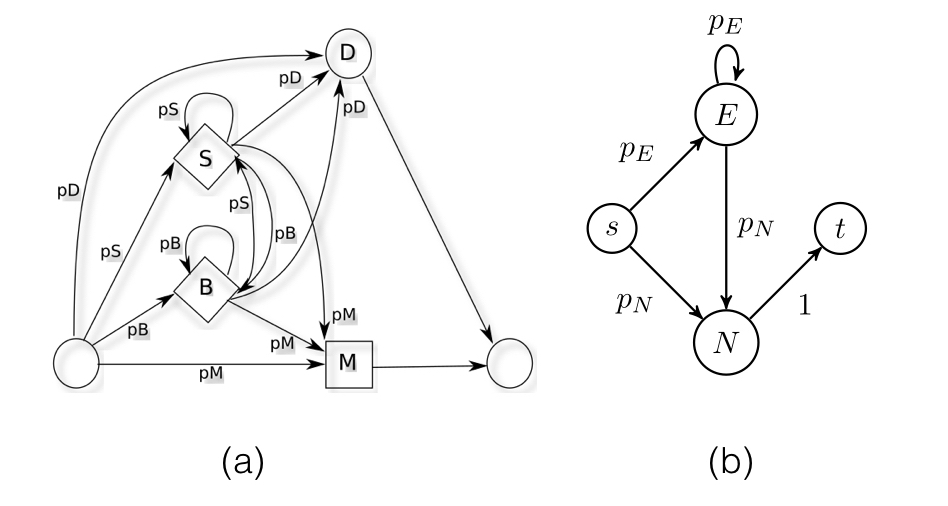

.. _zscore-math:

"Z-Score": when is a read completely garbage?
---------------------------------------------

Garbage-In-Garbage-Out: It is not always useful to estimate fine-scale
distinctions when looking at examples that have excessively high
noise. Estimation is likely to be improved by simplying filtering away
all examples that are irrecoverably "broken" as long as you still have
sufficient sample size on which to make estimates.

With "single-molecule-weirdness" such as long bursty inserts,
individual reads (or subsections of them) might contain very high
levels of noise. The current record for bursty insert is about 5.7kb
of inserted sequence that has nothing to do with the reference
template being sequenced. This can throw off alignments and consensus
models (CCS2) that do not explicitly model these bursty insert
behaviours.

While it would be best to solve these behaviors upstream at the
chemical/polymerase level, we must have defenses in place to at least
identify when these undesirable behaviors present themselves so we
might at least try to filter them away before they wreak havoc on
estimates.

Z-Score Motivation
------------------

The idea of the Z-Score is to compute the expected mean and variance
of the log likelihood (LL) of sequences output by a given HMM. Thus
when presented with a sequence that has a certain log probability, we
can reason how far removed it is to "normal" such that outliers can be
filtered away.  This Z-Score metric has shown some power at enabling
us to filter out truly aberrant reads from consensus calling.

The Arrow HMM model is a left-right "profile" HMM model; for each
template position, the model will arrive at either the match or delete
state corresponding to the template position, after sojourning through
the preceding branch/stick states some number of times.  A useful
reduction of the model collapses the Branch and Stick states into an
"E" ("Extra") state, and the Match/Delete states into an "N" ("Next")
state .  The following figure shows what the states look like
corresponding to each template position.

   (a) shows the states and edges corresponding to a single template
   position in the Arrow model; (b) shows a simplification where
   where we have collapsed the states that advance in the template
   (Match and Delete become "N" ("Next") and those that remain in
   place (Branch and Stick become "E" ("Extra"))

For each template position, then, we can calculate the expectation and
variance of the loglikelihood of sojourning through the "Extra" states
and finally arriving at a "Next" state (and performing all the
associated emissions).  The expectation of LL over all states is then
the sum of the expectation over each state.  We make independence
assumptions about the loglikelihood contributions from each state,
thus enabling the variance to be decomposed as a simple sum as well.

Z-Score parameters computation
------------------------------

*(Note that we use the nonstandard abbreviation* :math:`\log^k x = (\log x)^k` *in the following.)*

.. math::
   \newcommand{\E}{\textrm{E}}
   \newcommand{\Var}{\textrm{Var}}
   \newcommand{\Cov}{\textrm{Cov}}
   \newcommand{\ahrule}{\shortintertext{\rule{\textwidth}{0.5pt}}}
   \newcommand{\phantomeq}{\phantom{{}={}}}

*Definitions:*

.. math::
   \begin{aligned}
   L &= \textrm{likelihood}  \\
   E\textrm{(xtra)} &= B\textrm{(ranch or cognate extra)} + S\textrm{(tick or non-cognate extra)}  \\
   N\textrm{(ext)} &= M\textrm{(atch or incorporation)} + D\textrm{(eletion)}  \\
   \mathbb{O} &= \textrm{set of emission outcomes}  \\
   p_B &= \textrm{probability of a cognate extra}  \\
   p_S &= \textrm{probability of a non-cognate extra}  \\
   p_M &= \textrm{probability of an incorporation}  \\
   p_D &= \textrm{probability of a deletion}  \\
   p_E &= p_B + p_S  \\
   p_N &= p_M + p_D  \\
   p_N + p_E &= p_B + p_S + p_M + p_D = 1
   \end{aligned}

-------

*Identities:*

.. math::
   \begin{aligned}
   \sum_{k=0}^{\infty} p^k &= \frac{1}{1-p}, \textrm{ given } |p| < 1 \\
   \sum_{k=0}^{\infty} k p^k &= \frac{p}{(1-p)^2}, \textrm{ given } |p| < 1 \\
   \sum_{k=0}^{\infty} k^2 p^k &= \frac{p(1+p)}{(1-p)^3}, \textrm{ given } |p| < 1 \\
   \end{aligned}

-------

*Expected loglikelihood contribution from each state type:*

.. math::
   \E[\log L] &= \textrm{expected log-likelihood of the model}  \\
   \E[\log B] &= \textstyle{\sum_{o \in \mathbb{O}}} \Pr(o|B) \log \Pr(o|B)  \\ % \textrm{expected log-likelihood of cognate extra emission}  \\
   \E[\log S] &= \textstyle{\sum_{o \in \mathbb{O}}} \Pr(o|S) \log \Pr(o|S)  \\ % \textrm{expected log-likelihood of non-cognate extra emission}  \\
   \E[\log M] &= \textstyle{\sum_{o \in \mathbb{O}}} \Pr(o|M) \log \Pr(o|M)  \\ % \textrm{expected log-likelihood of incorporation emission}  \\
   \E[\log E] &= \frac{p_B}{p_B + p_S} (\log p_B + \E[\log B]) + \frac{p_S}{p_B + p_S} (\log p_S + \E[\log S])  \\
   \E[\log N] &= \frac{p_M}{p_M + p_D} (\log p_M + \E[\log M]) + \frac{p_D}{p_M + p_D} \log p_D  \\

-------

*Second moments*

.. math::
   \E[\log^2 L] &= \textrm{expected squared log-likelihood of the model}  \\
   \E[\log^2 B] &= \textstyle{\sum_{o \in \mathbb{O}}} \Pr(o|B) \log^2 \Pr(o|B)  \\ % \textrm{expected squared log-likelihood of cognate extra emission}  \\
   \E[\log^2 S] &= \textstyle{\sum_{o \in \mathbb{O}}} \Pr(o|S) \log^2 \Pr(o|S)  \\ % \textrm{expected squared log-likelihood of non-cognate extra emission}  \\
   \E[\log^2 M] &= \textstyle{\sum_{o \in \mathbb{O}}} \Pr(o|M) \log^2 \Pr(o|M)  \\ % \textrm{expected squared log-likelihood of incorporation emission}  \\
   \E[\log^2 E] &= \frac{p_B}{p_B + p_S} (\log^2 p_B + 2 \cdot \E[\log B] \log p_B + \E[\log^2 B]) \mathrel{+}  \\
   &\phantomeq \frac{p_S}{p_B + p_S} (\log^2 p_S + 2 \cdot \E[\log S] \log p_S + \E[\log^2 S])  \\
   \E[\log^2 N] &= \frac{p_M}{p_M + p_D} (\log^2 p_M + 2 \cdot \E[\log M] \log p_M + \E[\log^2 M]) + \frac{p_D}{p_M + p_D} \log^2 p_D  \\

-------

*Expected loglikelihood:*

.. math::
   \begin{align}
   \E[\log L] &= p_N \sum_{k=0}^{\infty} p_E^k \E[\log E^k N] \\
           &= p_N \sum_{k=0}^{\infty} p_E^k (k \E[\log E] + \E[\log N]) \\
           &= p_N \E[\log E] \sum_{k=0}^{\infty} k p_E^k + p_N \E[\log N] \sum_{k=0}^{\infty} p_E^k \\
           &= p_N \E[\log E] \frac{p_E}{p_N^2} + p_N \E[\log N] \frac{1}{p_N} \\
           &= \frac{p_E}{p_N} \E[\log E] + \E[\log N]
   \end{align}

---------

*Variance of loglikelihood*

.. math::
   \begin{align}
   \Var(\log L) &= \E[\log^2 L] - (\E[\log L])^2 \\
                &= p_N \sum_{k=0}^{\infty} p_E^k \E[(\log E^k N)^2] - (\E[\log L])^2 \\
                &= p_N \sum_{k=0}^{\infty} p_E^k (k \E[\log E] + \E[\log N])^2 - (\E[\log L])^2 \\
                &= p_N \sum_{k=0}^{\infty} p_E^k k^2 \E[\log^2 E] \mathrel{+}  \\
                &\phantomeq 2 p_N \sum_{k=0}^{\infty} p_E^k k \E[\log E] \E[\log N] \mathrel{+}  \\
                &\phantomeq p_N \sum_{k=0}^{\infty} p_E^k \E[\log^2 N] \mathrel{-}  \\
                &\phantomeq (\E[\log L])^2 \\
                &= p_N \E[\log^2 E] \frac{p_E (1+p_E)}{p_N^3} \mathrel{+}  \\
                &\phantomeq 2 p_N \E[\log E] \E[\log N] \frac{p_E}{p_N^2} \mathrel{+}  \\
                &\phantomeq p_N \E[\log^2 N] \frac{1}{p_N} \mathrel{-}  \\
                &\phantomeq (\E[\log L])^2 \\
                &= \frac{p_E (1 + p_E)}{p_N^2} \E[\log^2 E] + 2 \frac{p_E}{p_N} \E[\log E] \E[\log N] + \E[\log^2 N] - (\E[\log L])^2
   \end{align}

Z-Score Shortcomings
--------------------

Unfortunately, a small region of deviance may not be noticed in a long
read---bursty errors occur in localized regions.  Overall the number
of errors, if they were randomly distributed across the read, might be
within what might be expected normally. The fact that they are all
localized is what makes it abnormal.

An HMM can identify these localized bursts. The Viterbi path assigns
each match/delete state to a position in the read
:math:`(ref_i->read_j \mbox{ with } prob_i)`. Because the HMM is a
regular language, we know if :math:`ref_i` derives the string starting
at :math:`read_j` with :math:`prob_i` and :math:`ref_{i+1}` derives
with :math:`prob_{i+1}` then :math:`ref_i` derives it's portion with
probability (:math:`prob_i / prob_{i+1}`) (or differences in log
probability if using log probability). This is the part of the HMM
that accounts for a single reference base. We can use the same Z-Score
ideas to determine outliers. If the substate HMM derives 4 or less
bases 99.999% of the time, then if in the Viterbi path a derivation of
200 bases is observed, then we can conclude this is an outlier bursty
insert between this and then next reference base. (Similar ideas exist
for forward / backward / posterior.)
