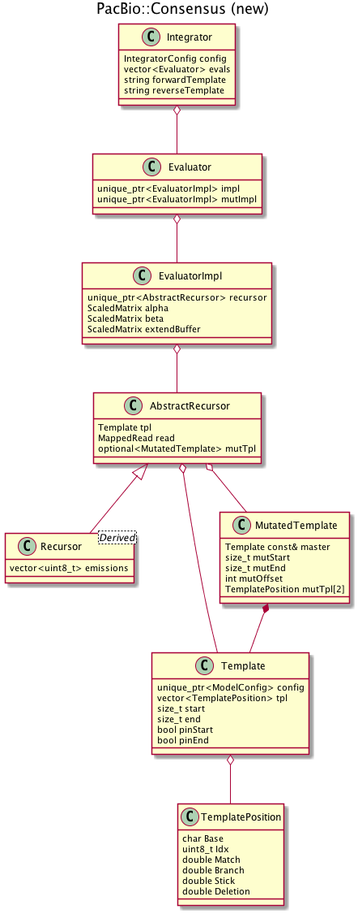

``ConsensusCore2``: design and implementation
===========================================


| **Authors:** David Alexander, Michael Brown, Nigel Delaney, Lance Hepler, Armin Töpfer, David Seifert
| **Last modified:** August 2, 2017


Motivation
----------

PacBio raw reads are highly error prone compared to short read
technologies.  Confident inference about the underlying DNA sequence
can only be made on the basis of multiple observations---either
multiple read passes of the insert from a single ZMW, or multiple
reads otherwise determined to correspond to a common genomic region
(for example, because they map to the same window of the reference).
The problem of identifying the most plausible underlying DNA sequence,
based on multiple observations, is termed *consensus*.

Consensus is trivial for short read platforms because errors are
predominantly *mismatch errors*; in such a world one can confidently
call consensus by performing a multiple alignment and voting in each
column.

The consensus problem is more challenging for PacBio reads because the
predominant error type is insertions and deletions, especially in
homopolymer sequences.  While heuristic approaches based on multiple
alignment are possible even in this context, we have found better
results by taking the approach of modeling consensus in a probabilistic
framework, asking the question "what is the probability that an
underlying *template* sequence T generated an observed read sequence
R?", and then using the model :math:`\Pr(R ; T)` to answer the
multi-read consensus problem via maximum likelihood---the consensus
sequence then mathematically defined as :math:`\arg\max_T
\Pr(\mathbf{R} ; T)`, where :math:`\mathbf{R}` represents the
vector of multiple reads.  The parameter space of the likelihood
function is the generalised sequence space.  The maximum likelihood
problem on this space is in general NP-hard and can only be solved in
a heuristic fashion.

Such a likelihood model is implemented using standard techniques from
the hidden Markov model (HMM) literature.  Evaluating the likelihood
is made tractable by approximating full dynamic programming using
banding, and, critically, the maximum likelihood search is made
tractable using a greedy search and a core routine using a
forward-backward identity that enables fast (:math:`O(1)`)
recalculation of the likelihood when the template is mutated pointwise,
:math:`T \to T+\mu`.

The consensus problem has multiple guises, as we have mentioned.  In
the *circular consensus sequence* application (*CCS*), multiple
successive reads from of a single circularized DNA insert template (a
*SMRTbell*) are gathered and used as evidence for a more confident
consensus sequence for the molecule.  In *genomic consensus*, reads
from many molecules are mapped to a reference genome or a "draft"
assembly, then a consensus sequence is generated for the genome by
aggregating together the reads mapping to each genomic region.  In the
context of a reference genome, this application is referred to as
*resequencing* and while a consensus sequence is produced, the goal is
typically to identify *variants*---positions evidencing variation from
the reference genome.  In the context of a "draft" assembly, the
application is referred to as "polishing" and the goal is simply to
produce the most accurate sequence of the genome as possible.

.. figure:: img/consensus-modalities.*
   :width: 100%

   *Consensus can applied in a single-molecule or multi-molecule
   context, for different applications.*


History
-------

An initial consensus model (named `Quiver` in 2012) was originated in
the original CCS implementation (ca. 2010) and proved capable of
generating consensus sequences with accuracy near Q25 provided enough
evidence---enough "passes" of the insert DNA.  The initial codebase
was in C# with some routines in C/C++.  In 2012-2013, the core of the
Quiver consensus algorithm was exported to a C++ library,
``ConsensusCore``, which provided SWIG bindings to higher-level host
languages (Python and C#, in chief), enabling use from other
applications .  The C# algorithm implementation was replaced by calls
to the ``ConsensusCore`` library; simultaneously, a Python application
(``GenomicConsenus``) was developed for applications in genome
assembly polishing, yielding very successful results: over Q50 (and in
some cases, over Q60) accuracy achieved on bacterial genome
assemblies.

The arrival of the ``GenomicConsensus`` application coincided roughly
with the initial development of HGAP (the Hierarchical Genome Assembly
Program), thus offering fast end-to-end genome assembly with
exceptionally high quality results, establishing PacBio as a player in
the fields of "sequence finishing" and microbiology in 2013.
Throughput improvements over time then made PacBio assembly appealing
for larger genomes, including fungi, plants, and animals.

Analyses of CCS results using the Quiver model showed evidence that
CCS was far from a solved problem.  First of all, the accuracy of CCS
results were found to fall short of the accuracy from multi-molecule
consensus sequences with comparable "coverage" in multiple controlled
experiments.  Perhaps more troubling, it was observed that consensus
accuracy "saturated", failing to increase beyond a certain number of
passes.  This is indicative of certain systematic effects at high pass
numbers not being accounted for by the model.

Experiments suggested that part of this problem was due to a failure
to account for ZMW-specific variables in the Quiver model; "genomic"
consensus was not subject to this problem because multiple molecules
would average out any ZMW-specific effects.  Another defect of the
Quiver model was that it was trained in a "discriminative" fashion,
which we believe biased the model in a manner that prevented convergence
to perfect accuracy as the number of CCS passes increased.  Furthermore,
discriminative models are harder to validate, since such models do not
allow for directly simulating data from.

In addition to the deficiencies in accuracy, the Quiver model also was
burdensome from the a software engineering perspective.  It was
unusable as an "inference" tool---there was no way to use it to
estimate underlying physical sequencing HMM parameters (merge rates,
for example); a completely separate codebase and tool (EDNA) was used
for this purpose---imposing a maintenance burden.  Furthermore, the
nonstandard derivative-free optimization method that was used to train
Quiver was slow and unreliable, making it unsuitable for use in an
automated training pipeline.

These observations motivated the development of a new model, based on
standard likelihood theory and standard training techniques, and
suitable as an inference tool to replace EDNA.  The new generative
model paradigm is called "Arrow" and has been pioneered by Nigel Delaney
and is implemented in two different code bases.  The code for inferring
the HMM parameters of the model is implemented in a hybrid R and C++
codebase called "UniteEM".  With the inferred parameters, the HMM can
be used to infer single/multi-molecule consensus sequences.  The CCS
inference model is implemented in the pure C++ "unanimity" code base.


The Arrow model
---------------

The Quiver model was effectively a "conditional random field" over
multivariate observations that encompassed the base calls and multiple
additional "QV" tracks emitted by the basecaller.  However it was not
trained in a standard manner; rather it was trained using an
unreliable and slow derivative-free optimization and with an objective
function that reflected a non-standard likelihood function more akin
to a classification accuracy.  Furthermore, its ability to adapt to
different chemistries is hampered by its extremely slow and

The Arrow model is a complete reboot.  It is a left-right HMM model,
very similar to the standard textbook left-right sequence "profile"
HMM.  Arrow differs from those models in a few key ways.  First, while
the standard profile HMM just models sequence alignment moves (Match,
Insert, Delete), Arrow models the enzymatic and photophysical events
(Sticks, Branches, (Mis)incorporations, Merges, and "dark" pulses)
underlying such moves in SMRT sequencing.  Secondly, emission and
transition parameters are not estimated independently for every state;
rather the states are "tied" by the dinucleotide template context.
Third, the transition parameters form a homogeneous Markov chain, that
is, the transition parameters only depend on the base pulsewidth (PW),
the dinucleotide context of the template and the ZMW SNR and not on the
position within the template.  The current incarnation of the model does
not take the interpulse duration (IPD) into account.  Fourth, the
transition parameters are "tied", depending only on the template position
and not on the state the model is in; this simplification enables computing
the model using a single matrix matrix instead of one per state type. Said
differently, initiating or extending an insertion or deletion has the same
probability, being closely related to classic linear sequence alignment.

.. figure:: img/hmms.*
   :width: 100%

   *The standard profile HMM (A) uses states to model alignment moves
   (Match, Insert, Delete), while the Arrow HMM (B) models the
   underlying physical events (which themselves give rise to
   "alignment" moves).  Otherwise, the models are quite similar.*

While the Arrow model can be used to estimate transition and emission
parameters freely for each read (the "EDNA" use case), in the more
common case emission parameters are only estimated per dinucleotide
context, combining all reads, while the transition probability
parameters are expected to follow a regression model on a few scalar
read covariates (at present, the only covariate used in this manner is
the read's SNR).

The Arrow model is trained using the standard Baum-Welch EM algorithm
procedure; the only extension here is that when the SNR is used as a
covariate, the M step requires maximum likelihood estimation of
a multinomial logistic model:

.. math::

   p_{MM}(i) &= \Pr(M_{i} \to M_{i+1} \mid T_{i-1}, T_{i}, \text{SNR})
   p_{MB}(i) &= \Pr(M_{i} \to B_{i} \mid T_{i-1}, T_{i}, \text{SNR})
   p_{MS}(i) &= \Pr(M_{i} \to S_{i} \mid T_{i-1}, T_{i}, \text{SNR})
   p_{MD}(i) &= \Pr(M_{i} \to D_{i+1} \mid T_{i-1}, T_{i}, \text{SNR})
   \log(p_{MB}(i) / p_{MM}(i)) &= \beta_{0,B} + \beta_{1,B} \cdot \text{SNR} + \beta_{2,B} \cdot \text{SNR}^2 + \beta_{3,B} \cdot \text{SNR}^3
   \log(p_{MS}(i) / p_{MM}(i)) &= \beta_{0,S} + \beta_{1,S} \cdot \text{SNR} + \beta_{2,S} \cdot \text{SNR}^2 + \beta_{3,S} \cdot \text{SNR}^3
   \log(p_{MD}(i) / p_{MM}(i)) &= \beta_{0,D} + \beta_{1,D} \cdot \text{SNR} + \beta_{2,D} \cdot \text{SNR}^2 + \beta_{3,D} \cdot \text{SNR}^3

where the :math:`SNR` values are per ZMW.  The emissions parameters
can depend on the pulsewidth of the sequenced base.  The current Arrow
implementation clamps pulsewidths into bins of 3.  We have observed
that pulsewidths of 3 frames and longer and generally safe calls, such
that the accuracy of the algorithm is not significantly improved by
making this covariate space any larger.  On the other hand, very short
frames are likely to be sticks, and are often already excluded by the
single frame exclusion filter from primary analysis.


Algorithm overview
------------------


Implementation
--------------

Draft consensus by partial-order alignment
~~~~~~~~~~~~~~~~~~~~~~~~~~~~~~~~~~~~~~~~~~

A significant factor for performance of the unanimity model is finding
an initial point in sequence space that is as close to the optimal
value as possible.  The simplest way to come to an initial estimate of
the template is employing multiple sequence alignment and then calling
an initial consensus sequence by majority vote.  Unfortunately, standard
multiple sequence alignment algorithms are slow, since they were
designed for multiple sequence alignment of biological species and genes
and not as data processing steps.  Unanimity's initial consensus
construction is based on Partial-Order Alignment (POA), which is
significantly faster than standard progressive alignement strategies.
This procedure is documented in the supplement of [HGAP_DAGcon]_

.. [HGAP_DAGcon] Chin, Chen-Shan, et al. "Nonhybrid, finished microbial
   genome assemblies from long-read SMRT sequencing data."
   Nature Methods 10.6 (2013): 563-569.


The essence: calculating, and re-calculating, likelihood
~~~~~~~~~~~~~~~~~~~~~~~~~~~~~~~~~~~~~~~~~~~~~~~~~~~~~~~~

Unlike the former Quiver algorithm, which employed a Viterbi algorithm,
Unanimity employs the forward and backward algorithm for inferring
consensus sequences.  Statistically, marginalizing over all alignments
is more robust, as single alignment artifacts tend to average out,
whereas the output of a Viterbi algorithm is the likelihood of an
(optimal) single path.  Furthermore, in CCS applications, the exact
alignment of each subread to the final template is not of interest,
such that asking for the marginal likelihood without any specific
alignment in mind is more relevant to the statistical question.

The current implementation implements the forward and backward matrices::

      t e m p l a t e
   s  x x x
   u    x x x
   b      x x x
   r        x x x
   e          x x x
   a            x x x
   d              x x

with the template along the columns and the (sub)read along the rows.
Here the 'x' represent actual entries, and missing entries indicate
values that have not been calculated.


Practical and numerical aspects
~~~~~~~~~~~~~~~~~~~~~~~~~~~~~~~

Scaling vs log-domain math
``````````````````````````

The naive approach to computing likelihoods in an HMM inevitably runs
afoul of numerical underflow, as many probabilities are multiplied
together.  The standard practical solutions are to compute all matrix
entries (probabilities) in the log-domain, or to scale each row or
column

The choice of scaling or log-domain math has implications for the math
required in the different calculations we need to perform.  For a Viterbi
probability, we have to calculate recursively

.. math::

   V_{j}(i) = \log{\Pr}_{M_j}(x_i) + \max
   \begin{cases}
   V_{j-1}(i-1) &+ \log\Pr(M_{j-1} \to M_j)\\
   V_{j}(i-1) &+ \log\Pr(I_{j} \to M_j)\\
   V_{j-1}(i) &+ \log\Pr(D_{j-1} \to M_j)
   \end{cases}

Notice that all calculations occur exclusively in log-space, and is thus
numerically very stable.  For the forward algorithm, we need to calculate
recursively

.. math::

   F_{j}(i) = \log{\Pr}_{M_j}(x_i) + \log\big(
   &\exp(F_{j-1}(i-1)) \cdot \log\Pr(M_{j-1} \to M_j) \\
   +&\exp(F_{j}(i-1)) \cdot \log\Pr(I_{j} \to M_j) \\
   +&\exp(F_{j-1}(i)) \cdot \log\Pr(D_{j-1} \to M_j)\big)

This is the previous :math:`\max` replaced by a :math:`\sum`. Numerically,
taking the log of a sum is unstable, which is further exacerbated by
changing from log-space to real space for the intermediate marginalization.
In effect, log-space calculations make the forward and backward algorithm
not one iota more stable, as intermediate calculations are prone to the
same underflow issues as if the whole problem were done in real space.
For this reason, Unanimity implements column-scaled matrices, where each
column is scaled by its maximum entry.  This avoids log transformation,
keeps numerical issues at bay at the slight cost of some extra book
keeping memory.


Banding
```````

Computing the entire dynamic-programming matrices is prohibitively
expensive in memory and CPU time, given the number and size of
matrices we need to compute.  Rather, we use an implicit *banded dynamic
programming* approach where we only compute and retain a high-scoring
band in each matrix column; these bands should capture all of the
alignment paths describing how T induces R that significantly contribute
to the probability mass of the likelihood function.

Banding is presently performed "on the fly", as the matrix (alpha or
beta) itself is filled.  The column is filled, starting from the first
filled row of the previous column, and we continue to fill it until it
falls below the maximum score in the column by more than
``scoreDiff``.  Finally, we scan back to identify the first row in the
column within ``scoreDiff`` of the max.  This interval is then
recorded as the nominally "filled"  band of the column.

An important requirement of the banding is that the bands of the
forward (alpha) and backward (beta) matrices must be concordant,
meaning that they overlap sufficiently such that the forward-backward
identity can still hold despite the bands.  Another way of looking at
this is that *all* high probability paths in alpha must be calculated
in beta, and vice versa, so that the "link" operation can find a path.

In practice, we check for correct "mating" of the alpha and beta
matrices by first... TODO

This banding approach is implemented using sparse matrices.  Since sparse
matrices ultimately represent another layer of indirection, they are not
laid out contiguously in memory.  This makes using modern CPU intrinsics
nigh impossible to implement, as these require contiguous memory.
In the future we hope to adopt a *pre-banding* approach where we
identify the likely high-scoring bands by a preliminary SDP step.
Ideally, this will eliminate the need for flip-flopping, simplify the
inner loop of the recursions, and make the bandwidth of the forward
and backward matrices fixed from the outset of each ZMW inference.  This
will allow us to employ modern SIMD techniques to gain sizable speedups.


Counterweights
``````````````

It is interesting to consider the score of the path that proceeds
through the alpha matrix along the top row, then finally moving down
to the bottom-right entry when it reaches the last column.  This can
be thought of as an "alignment" that "deletes" all the template bases,
then "inserts" the read bases in at the end.  This is a poor alignment
by any estimation, but it defeats our "on the fly" banding procedure.

.. todo:: picture here, showing the path and its two segments

In particular, note that the segment 1 describes a path through the
Markov model that produces no emissions.  The likelihood for this
segment then has many fewer multiplicative probability factors than
segments that move downward.  Unless the transition probability into
or from the delete state is sufficiently low---which is in no way
guaranteed by the HMM or its training---then, these paths to the right
will seem locally favorable---the penalty is not felt until the
emissions must be made later.  That is, even for a perfect sequence-
template match alignment (alignment on the diagonal), locally the
alignment is always biased towards deletions.  The greedy "on the fly"
banding procedure thus may become too liberal and become too slow in
practice to be of any value.

This problem presents itself as excessively wide bands, spanning from
near the diagonal to the path 1->2.

Presently, we avoid this problem by artificially penalizing deletions
(or, alternately, by encouraging emissions) using what we term a
*counterweight*: a constant positive value added to the score of each
matrix cell for each emission, used for purposes of band calculation
only.

If we adopt pre-banding, we can eliminate the need for using
counterweights.


Batching of mutations
`````````````````````

TODO

Coding conventions
~~~~~~~~~~~~~~~~~~

Setup for calling consensus: the ``Integrator`` classes
~~~~~~~~~~~~~~~~~~~~~~~~~~~~~~~~~~~~~~~~~~~~~~~~~~~~~~~

The hierarchy of classes of the Unanimity framework:



The basic setup for computing a consensus sequence from reads (and a
draft consensus) is to build an ``Integrator`` object.  After creating
an integrator for a given model configuration and template DNA sequence
hypothesis, client code then adds ``MappedRead`` objects to the integrator;
``MappedRead`` objects represent the read data (including covariates)
and also indicate the start/end positions where it is anchored on the
template sequence.  Once this is done, client code then calls the
``Polish`` function, which performs the iterative greedy search
procedure, returning a ``PolishResult`` object recording iteration
count and other metrics, while as a side effect updating the
``Integrator`` object to point at the maximum likelihood consensus.

``Integrator`` objects support polishing by exposing methods that
enable testing and committing mutations to the underlying template.
This requires a good deal of bookkeeping internally, as each mutation
applied requires potential updates to the read-to-template anchor
mappings.


The workhorse: the Recursor class
~~~~~~~~~~~~~~~~~~~~~~~~~~~~~~~~~

The computational heart of the Unanimity codebase lives in the Recursor.
It performs the banded filling of the forward and backward matrices.
Unlike most other classes, the interface of the Recursor eschews virtual
functions and is templated using the CRTP (curiously recurring template
pattern). The CRTP is necessary here, as the penalty of calling into
model/chemistry specific member functions in tight inner loops when
filling the forward and backward matrices.  The derived implementation
template classes of the CRTP are implemented by the models, such that
when compiling with full optimization, all indirection via the base
template class gets elided.

Model lookup
~~~~~~~~~~~~

All chemistry models are specified in the directory ``src/models`` and
implement the ``ModelConfig`` interface.  The ``ModelConfig`` interface
allows for querying the supported chemistry SKU, generating the HMM
given an SNR.

Model lookup is performed via the associated read group of a read.
The ``ModelConfig`` class possess a factory function for instantiating
handles to concrete classes, which only requires a string specifying
the chemistry tuple.

Model parameter lookup
~~~~~~~~~~~~~~~~~~~~~~

Unanimity has two classes of model specifications: The first class of
models have their estimated parameters recorded in their source files.
The idea of this compile time parameter specification is to allow for
maximal optimization opportunity.  The second class of models can load
their parameters at run-time.  From practical observations it has been
determined that the compile-time specified models yield a performance
boost of 10-15%. All models are implemented in the ``src/models``
directory.

Training
~~~~~~~~

Training is performed by using a standard Baum-Welch (i.e., the EM
algorithm for HMMs) algorithm with known ground-truth genomic data.

Identifying (and removing) aberrant reads: the "ZScore" concept
~~~~~~~~~~~~~~~~~~~~~~~~~~~~~~~~~~~~~~~~~~~~~~~~~~~~~~~~~~~~~~~

Basic explanation goes here.

For the mathematical details of how the variance and expectation are
calculated, see :ref:`zscore-math`.


Appendices: the gory details
----------------------------

.. toctree::
   :maxdepth: 1

   ZScoreMath
   CounterWeightMath
