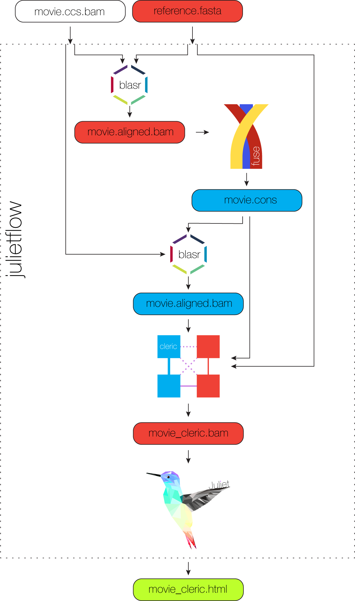

<h1 align="center">
    julietflow - Minor variant pipeline
</h1>

## Install
The script is located under `scripts/minorvariant/julietflow`.

## Input data
*Julietflow* operates on unaligned ccs reads in the BAM format and a close
reference sequence.
BAM files has to PacBio-compliant, meaning, cigar `M` is forbidden, and input
reads have to be greater RQ 0.99.

## Scope
Current scope of *julietflow* is automatization of the re-align workflow for
minor variant calling.

## Output
*Julietflow* provides the html output of juliet in the current directory and the
intermediate files in `tmp/` if `-k` is set.

## Example
```
julietflow -i m530526.ccs.bam -r hxb2.fasta
```

Output: `m530526_cleric.html`

## Dependencies
*Julietflow* currently depends on [juliet](JULIET.md), [cleric](CLERIC.md), and
[fuse](FUSE.md) all of which are part of unanimity,
[blasr](https://github.com/PacificBiosciences/blasr), and
[samtools](https://github.com/samtools/samtools). Those are all part of the
SMRT-bundle that is officially being provided by PacBio.

## Help
Please use `--help` for more options of *julietflow*.

## Workflow
<p align="center">
  
</p>