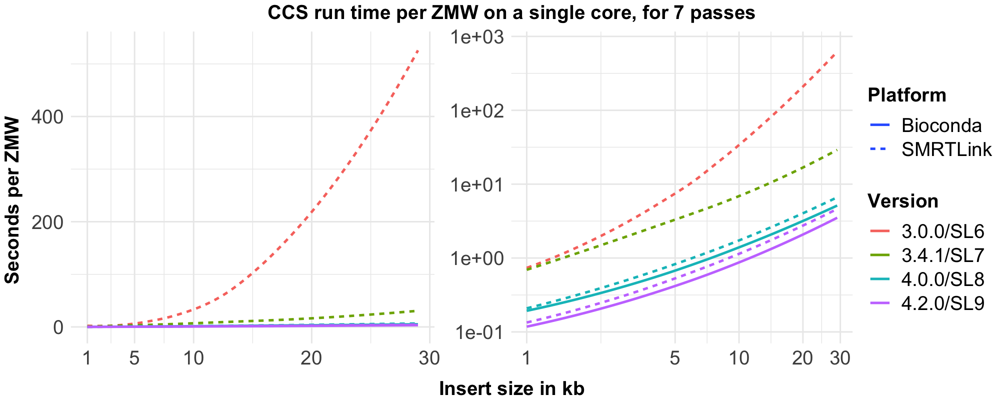

## How fast is _ccs_?
### Latest version
_ccs_ v6.0 can process 200 GBases HiFi yield in 24 hours for a 25 KBases
library on 2x64 cores at 2.4 GHz.
To put this into perspective for actual sequencing collections:

| Sample  | Insert size | HiFi Yield  | Run Time |
| :-----: | :---------: | :---------: | :------: |
|  HG002  |  15 KBases  | 41.1 GBases |  5h 52m  |
|  HG002  |  18 KBases  | 34.0 GBases |  4h 36m  |
| Redwood |  25 KBases  | 32.4 GBases |  3h 46m  |

### Relative performance v3.0 to v6.0
Current _ccs_ v6 achieves a >150x speed-up for 20 KBases inserts compared to
v3.0 from SMRT Link 6.0 release in 2018.

### Algorithmic complexity
To understand how this performance gain was possible, an overview how we changed
the algorithmic complexity and how _ccs_ scales with insert size and number of passes:

| CCS version | O(insert size) |  O(#passes)   |
| :---------: | :------------: | :-----------: |
|   ≤3.0.0    |   quadratic    |    linear     |
|    3.4.1    |   **linear**   |    linear     |
|   ≥4.0.0    |     linear     | **sublinear** |

To visualize this table, we benchmarked runtime using 500 ZMWs per length bin with
exactly 7 passes.



After v4.0.0, the slope of the curve does not change, as the complexity class
hasn't changed; only improvements independent of input type were made.

### Performance comparisons
Performance comparisons on different libraries; the `faster` column is with
respect to the run time of the previous version. All runs were performed on the
same hardware with 256 threads. A major part of the speed increase in v5.0 is
due to toolchain improvements for generating a more optimized binary.
#### **HG002 15kb SQII, 41 GBases HiFi yield**

| CCS Version | HiFi Reads | Run Time | CPU Time | Peak RSS | Faster |
| :---------: | :--------: | :------: | :------: | :------: | :----: |
|    4.0.0    | 2,765,431  | 13h 14m  | 89d 13h  |  71 GB   |        |
|    4.2.0    | 2,806,886  | 10h 47m  |  61d 9h  |  72 GB   |  18%   |
|    5.0.0    | 2,807,317  |  6h 44m  | 62d 22h  |  27 GB   |  37%   |
|    6.0.0    | 2,831,192  |  5h 52m  | 44d 17h  |  20 GB   |  13%   |
|    6.2.0    |    TBD     |   TBD    |   TBD    |   TBD    |  TBD   |

#### **HG002 18kb SQII, 32 GBases HiFi yield**
Omitting v4.0.0, due to lack of chemistry support.

| CCS Version | HiFi Reads | Run Time | CPU Time | Peak RSS | Faster |
| :---------: | :--------: | :------: | :------: | :------: | :----: |
|    4.2.0    |  1823016   |  8h 35m  | 47d 13h  |  80 GB   |        |
|    5.0.0    |  1824206   |  5h 29m  | 50d 16h  |  46 GB   |  36%   |
|    6.0.0    |  1855604   |  4h 36m  | 30d 13h  |  18 GB   |  15%   |
|    6.2.0    |    TBD     |   TBD    |   TBD    |   TBD    |  TBD   |

#### **Redwood 25kb SQII, 32 GBases HiFi yield**

| CCS Version | HiFi Reads | Run Time | CPU Time | Peak RSS | Faster |
| :---------: | :--------: | :------: | :------: | :------: | :----: |
|    4.0.0    | 1,269,680  |  7h 58m  | 60d 19h  |  72 GB   |        |
|    4.2.0    | 1,310,775  |  6h 37m  | 43d 18h  |  74 GB   |  17%   |
|    5.0.0    | 1,311,693  |  4h 36m  | 41d 13h  |  41 GB   |  30%   |
|    6.0.0    | 1,335,888  |  3h 56m  | 25d 11h  |  17 GB   |  14%   |
|    6.2.0    |    TBD     |   TBD    |   TBD    |   TBD    |  TBD   |

### How is CCS speed affected by raw base yield?
Raw base yield is the sum of all polymerase read lengths.
A polymerase read consists of all subreads concatenated
with SMRTbell adapters in between.

Raw base yield can be increased with
1) higher percentage of single-loaded ZMWs and
2) longer movie times that lead to longer polymerase read lengths.

Since the first version, _ccs_ scales linear in (1) the number of single loaded
ZMWs per SMRT Cell.
Starting with version 3.3.0 _ccs_ scales linear in (2) the polymerase read length
and with version 4.0.0 _ccs_ scales sublinear.

### How can version 4.0.0 be sublinear in the number of passes?
With the introduction of improved heuristics, individual draft bases can skip
polishing if they are of sufficient quality.
The more passes a ZMW has, the fewer bases need additional polishing.

## Can I tune _ccs_ to get improved results?
No, we optimized _ccs_ such that there is a good balance between speed and
output quality.

## Does speed impact quality and yield?
Yes it does. With >150x speed improvements from version 3.0 to 6.0,
heuristics and changes in algorithms lead to slightly different yield and
accuracy if run head-to-head on the same data set. Internal tests show
that _ccs_ 6.0 introduces no regressions in _ccs_-only Structural Variant
calling and has minimal impact on SNV and indel calling in DeepVariant.
In contrast, lower DNA quality and sample preparation has a bigger impact
on quality and yield.

## Can I tune performance without sacrificing output quality?
The bioconda _ccs_ ≥v5.0 binaries statically link [mimalloc](https://github.com/microsoft/mimalloc).
Depending on your system, additional performance tuning can be achieved.
Internally, we use following mimalloc environment variables to improve _ccs_
performance.

```
MIMALLOC_PAGE_RESET=0 MIMALLOC_LARGE_OS_PAGES=1 ccs <movie>.subreads.bam ccs.bam --log-level INFO
```
