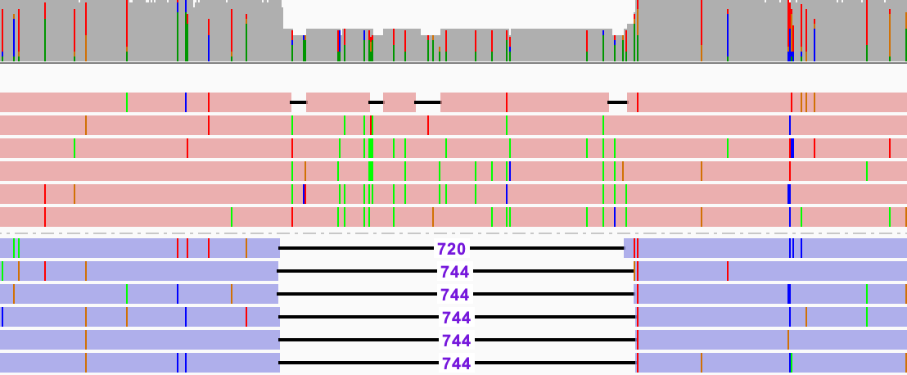

## How do I read the ccs_report.txt file?
By default, each CCS run generates a `<outputPrefix>.ccs_report.txt` file.
This file summarizes how many ZMWs generated HiFi reads (CCS) and how many
failed CCS generation because of the listed causes. For those failing, each ZMW
contributes to exactly one reason of failure; percentages are with respect to
number of failed ZMWs.

The following comments refer to the filters that are explained in the FAQ above.

    ZMWs input               : 1671

    ZMWs pass filters        : 824 (49.31%)                                    ┐
    ZMWs fail filters        : 104 (6.22%)                                     | Sum to 100%
    ZMWs shortcut filters    : 743 (44.46%) <- Low-pass ZMWs skipped by --all  ┘

    ZMWs with tandem repeats : 10 (0.60%)   <- With repeats larger than --min-tandem-repeat-length

    Exclusive failed counts
    Below SNR threshold      : 30 (28.85%)  <- SNR below --min-snr.
    Median length filter     : 0 (0.00%)    <- All subreads are <50% or >200% of the median subread length
    Lacking full passes      : 0 (0.00%)    <- Fewer than --min-passes full-length (FL) reads
    Heteroduplex insertions  : 10 (9.62%)   <- Single-strand artifacts
    Coverage drops           : 43 (41.35%)  <- Coverage drops would lead to unreliable polishing results
    Insufficient draft cov   : 16 (15.38%)  <- Not enough subreads aligned to draft end-to-end
    Draft too different      : 0 (0.00%)    <- Fewer than --min-passes FL reads aligned to draft
    Draft generation error   : 3 (2.88%)    <- Subreads don't agree to generate a draft sequence
    Draft above --max-length : 0 (0.00%)    <- Draft sequence is longer than --max-length
    Draft below --min-length : 0 (0.00%)    <- Draft sequence is shorter than --min-length
    Reads failed polishing   : 0 (0.00%)    <- Too many subreads were dropped while polishing
    Empty coverage windows   : 2 (1.92%)    <- At least one window has no coverage
    CCS did not converge     : 0 (0.00%)    <- Draft has too many errors that can't be polished in time
    CCS below minimum RQ     : 0 (0.00%)    <- Predicted accuracy is below --min-rq
    Unknown error            : 0 (0.00%)    <- Rare implementation errors

If run in `--by-strand` mode, please have a look at [the by-strand FAQ](/faq/mode-by-strand).\
If run in `--split-heteroduplexes` mode, please have a look at [the strand-aware FAQ](/faq/mode-heteroduplex-filtering).

### Coverage drops
Example for a coverage drop in a single ZMW, subreads colored by strand orientation:

<p align="center">
  
</p>

During sequencing of the molecule, one strand exhibits 744 more bases than its
reverse complemented strand. What happened?
Either there is a gain or loss of information.
An explanation for loss of information could be that a secondary structure,
the 744 bp forming a hairpin, could affect the replication during PCR and lead
to loss of bases.
Gain of information could also happen during PCR, when the polymerase gets stuck
and incorporates the current base too often.
In this example, there is a homopolymer of 744 `A` bases.
While it might be obvious to a human eye what happened,
its not the responsibility of _ccs_ to interpret and recover molecular damage.
Even if there were a low-complexity filter for those regions, setting the
appropriate threshold would be arbitrary;
would a 10bp homopolymer insertion be valid, but 11bp would get discarded?

## How do I read the zmw_metrics.json file?
Per default, each _ccs_ run generates a `<outputPrefix>.zmw_metrics.json.gz` file.
Change file name with `--metrics-json`.
The resulting `*.zmw_metrics.json` file has one field `zmws` that contains an
array. Each entry in this array describes one input ZMW. You can pretty print
its content with

    zcat out.zmw_metrics.json.gz | python3 -m json.tool

Example content with two ZMWs:

```json
{
  "zmws": [
    {
      "effective_coverage": 8.2,
      "has_tandem_repeat": false,
      "insert_size": 12972,
      "num_full_passes": 7,
      "polymerase_length": 111325,
      "predicted_accuracy": 0.998,
      "status": "SUCCESS",
      "wall_end": 5529991,
      "wall_start": 91,
      "zmw": "m64011_200315_001815/0"
    },
    {
      "effective_coverage": 1,
      "has_tandem_repeat": true,
      "insert_size": 12783,
      "num_full_passes": 1,
      "polymerase_length": 27511,
      "predicted_accuracy": -1.0,
      "status": "TOO_FEW_PASSES",
      "wall_end": 2425263,
      "wall_start": 1179648,
      "zmw": "m64011_200315_001815/2"
    },
  ]
}
```

Each ZMW consists of following fields:

  * `status`, did CCS finish with `SUCCESS` or fail with an error (identical order as in `ccs_reports.txt`):
    * `POOR_SNR`, All subreads were below SNR threshold `--min-snr` (1)
    * `NO_SUBREADS`, All subreads were filtered by the median length filter (2)
    * `TOO_FEW_PASSES`, Fewer than `--min-passes` full-length (FL) reads (3)
    * `LOW_PASS_SHORTCUT`, ZNW skipped polishing, active with [`--all`](/faq/mode-all)
    * `HETERODUPLEXES`, Single-strand artifacts, see definition of a [heteroduplex](/how-does-ccs-work#5-single-strand-artifacts)
    * `COVERAGE_DROPS`, Coverage drops against draft would lead to unreliable polishing results
    * `INSUFFICIENT_SPANS`, Not enough subreads aligned to draft end-to-end
    * `TOO_FEW_PASSES_AFTER_DRAFT_ALIGNMENT`, Fewer than `--min-passes` FL reads aligned to draft
    * `DRAFT_FAILURE`, Subreads don't agree to generate a draft sequence
    * `TOO_LONG`, Draft sequence is longer than `--max-length` (4)
    * `TOO_SHORT`,  Draft sequence is shorter than `--min-length` (4)
    * `TOO_MANY_UNUSABLE`, Too many subreads were dropped while polishing
    * `EMPTY_WINDOW_DURING_POLISHING`, At least one window has no coverage
    * `NON_CONVERGENT`, Draft has too many errors that can't be polished in time
    * `POOR_QUALITY`, Predicted accuracy is below --min-rq (5)
    * `EXCEPTION_THROWN`, Rare implementation errors
  * `effective_coverage`, average coverage used for polishing, more info [here](/faq/accuracy-vs-passes#how-is-number-of-passes-computed)
  * `has_tandem_repeat`, sDUST found a tandem repeat larger than `--min-tandem-repeat-length N`
  * `insert_size`, the length – in precedence order – of
    * the polished sequence if polishing was successful or
    * the draft sequence if draft generation was successful or
    * the subread of median length
  * `num_full_passes`, number of full-length subreads used, more info [here](/faq/accuracy-vs-passes#how-is-number-of-passes-computed)
  * `polymerase_length`, total number of bases produced from a ZMW after trimming the low-quality regions, including adapters
  * `predicted_accuracy`, also known as read quality, set to `-1` if not calculated
  * `wall_end`, start of last base of the polymerase read in approximate raw frame count since start of movie
  * `wall_start`, start of first base of the polymerase read in approximate raw frame count since start of movie
  * `zmw`, the ZMW ID

Additional fields starting with `_` are implementation details and are subject to change.

## Is there a progress report?
Yes. With `--log-level INFO`, _ccs_ provides status to `stderr` every
`--refresh-rate seconds` (default 5):

    37440/14155/55.3 20975/7960/31.1 2h 27m

The log output explains each field:

    Logging info: Z1/Z2/Z3 C1/C2/C3 ETA
    Z1: #ZMWs processed since start
    Z2: #ZMWs processed in the last minute
    Z3: #ZMWs processed in the last minute per thread
    C1: #CCSs generated since start
    C2: #CCSs generated in the last minute
    C3: #CCSs generated in the last minute per thread
    ETA: Estimated remaining run time, ~extrapolated

If there is no `.pbi` file present, ETA will be omitted.
