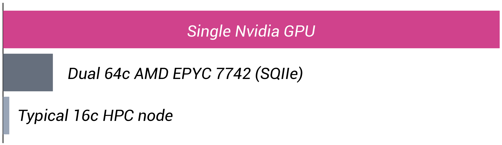
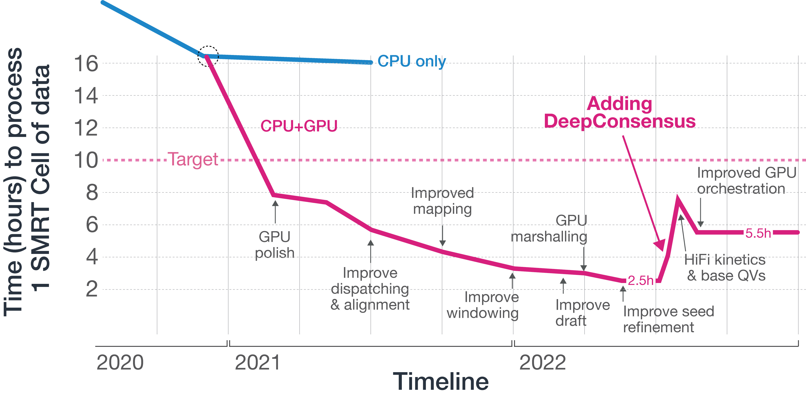

# Revio FAQ
## What _ccs_ differences are between Sequel IIe and Revio?
_ccs_ is always run on the Revio platform. Intermediate CLR BAM files are no
longer stored, nor can be transferred, as file sizes exceed one TBytes per
SMRT Cell 25M. Aside constant algorithmic improvements, there are few changes
since the 6.4.0 SQIIe release.

1. Arrow polishing is performed on the instrument.
2. DeepConsensus further increases quality of lower quality windows.
3. Performance improvements.
4. The customer-facing files layout changed.
5. A new `fail_reads.bam` has been introduced.

### GPU polishing

The polish algo in _ccs_ is an HMM, filling out matrices at its core. The nature
of its operations makes an efficient GPU implementation challenging. We’ve
ported it completely onto Nvidia GPUs and achieved a 10x speedup over a dual
64c AMD EPYC, easily the fastest HMM on GPU.

### DeepConsensus
We have tightly integrate Google's [DeepConsensus](https://github.com/google/deepconsensus)
into _ccs_. For this, we have implemented a C++ front-end using ONNXruntime
and accelerate it on TensorRT cores of modern data center Nvidia GPU cards.
HiFi read generation on the Revio system uses a multi-step process, which
also has an impact how the predicted read quality is computed:

1. Generate an initial consensus sequence and base quality values using the
   arrow Hidden Markov Model.
2. Pass windows with low quality from the initial consensus to the DeepConsensus
   deep learning model for further polishing. DeepConsensus refines the sequence
   and calculates base quality values for the windows it processes. For a
   typical human WGS run, somewhere between 30-70% of windows in a read are
   polished with DeepConsensus. The read quality is calculated after this stage
   as the average of the DeepConsensus (for processed windows) and arrow (for
   unprocessed windows) base quality values, as DeepConsensus and arrow are
   calibrated for their respective windows.
3. Having final base quality values come from a single model is critical to
   making them usable by downstream tools, so the refined sequence is processed
   again with arrow to calculate base quality values for all windows. The arrow
   model tends to slightly underestimate base quality in windows refined with
   DeepConsensus, so these final values are not used for calculating rq. For
   those that observe differences between rq and the mean of base qualities,
   this step may explain a significant source of those differences.
4. Finally, base quality values are binned into 7 quality bins to optimize file
   size.

### Performance
A quick timeline of the improvements that went into the Revio release with
SMRT Link v12.0.

### Files layout
With the introduction of the Revio platform, the directory structure and files
layout changed within each movie directory. We split _ccs_ reads into
`hifi_reads.bam` and `fail_reads.bam` instead of mixing them into one `reads.bam`
file.

### What is inside `fail_reads.bam`?
This new file contains following reads:
 - Polished reads that did not pass the HiFi Q20 threshold.
 - Reads that are from the spike-in control sample.
 - Single-stranded _ccs_ reads.
 - The median full-length subread of each ZMW that could not generate a consensus.
 - Reads with adapter concatemers.
 - Reads with miscalled adapters.
 - Reads with one or more adapters close to either end.
