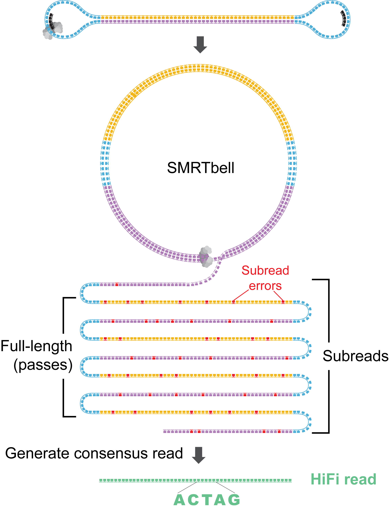
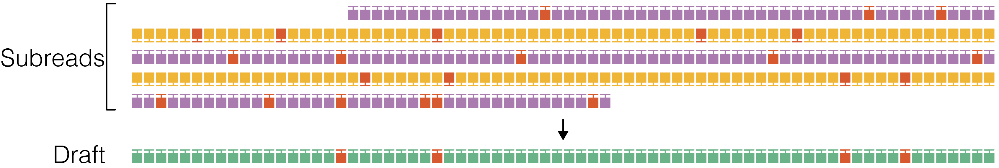
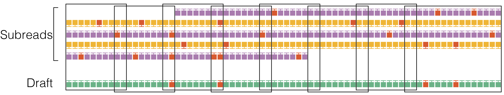
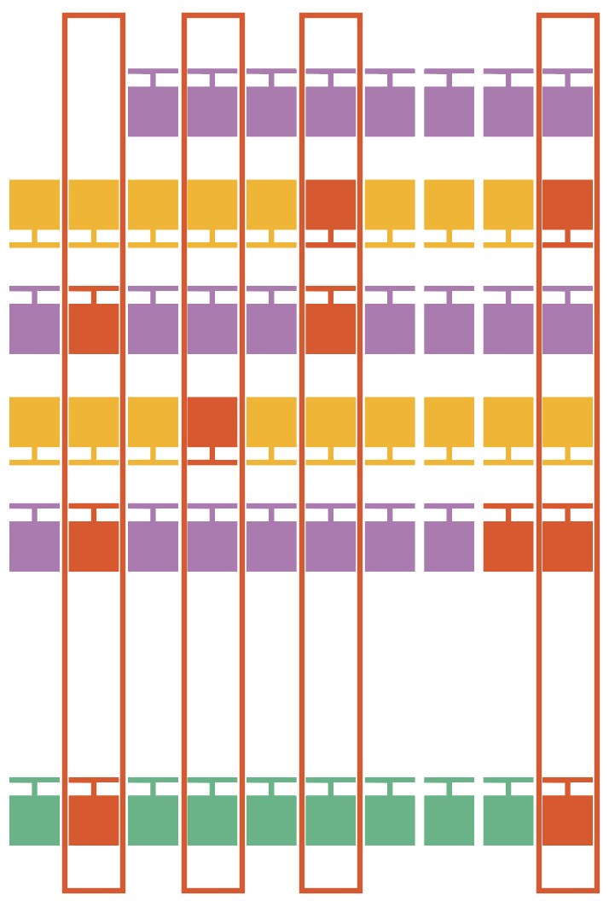

# 30,000-foot overview

# How does _ccs_ generate HiFi reads?
Each SMRTbell molecule is processed in two main stages:

 1. Generate an approximate draft consensus from a few subreads to provide a starting template for polishing.
 2. Iteratively polish the template using all subreads to generate a final consensus sequence.

The more detailed steps for a single ZMW are as follows.

## 1. Initial filtering
Filter ZMWs:
1. Remove ZMWs with signal-to-noise ratio (SNR) below `--min-snr`.

Filter subreads:
1. Remove subreads with lengths <50% or >200% of the median subread length.
2. Stop if number of full-length subreads is fewer than `--min-passes`.

**Why does the subread length filter use 50% and 200% thresholds?**\
Subreads that are longer than 200% of the median length are likely due to missed
adapter calls, where the initial polymerase read was wrongly split into subreads.
Subreads shorter than 50% ("partial" passes) are a challenge to map confidently
against the template, especially when the template is a palindromic sequence.
To avoid improper mappings, short subreads are excluded.

## 2. Draft generation
The polish stage iteratively improves upon a candidate template sequence.
Because polishing is very compute intensive, it is desirable to start with a
template that is as close as possible to the true sequence of the molecule to
reduce the number of iterations until convergence.
So, the _ccs_ software does not pick a full-length subread as the initial
template to be polished, but instead generates an approximate draft consensus
sequence using graph algorithms like [partial-order alignment](https://academic.oup.com/bioinformatics/article/18/3/452/236691) (POA)
[consensus](https://academic.oup.com/bioinformatics/article/19/8/999/235258),
employing an accelerated implementation called [SPOA](https://github.com/rvaser/spoa),
or our own alignment graph consensus caller, called pbdagcon.
Typically, subreads have accuracy of around 90% and the draft consensus has a
higher accuracy, but depending on the algorithm employed is still below 99%.

Stop if draft length is shorter than `--min-length` and longer than `--max-length`.

## 3. Alignment
Align subreads to the draft consensus for downstream windowing and filtering.

## 4. Windowing
Divide the the subread-to-draft alignment into overlapping windows with a target
size of 22 bp with ±2 bp overlap. Avoid breaking windows at simple repeats
(homopolymers to 4-mer repeats) to reduce edge cases at window borders.
Windowing reduces the algorithm run time from quadratic to linear in the insert size.

## 5. Single-strand artifacts
Identify heteroduplexes, where one strand of the SMRTbell differs significantly
from the reverse complement of the other strand.
Subread orientation is inferred from the alignment.
Small heteroduplexes, e.g., single base `A` paired with a matching `G`, are retained
and the ambiguity is reflected in base quality. Molecules with a single
difference longer than 20 bp between the strands are removed and recorded as
heteroduplexes in the `<outputPrefix>.ccs_report.txt` file.

## 6. Trim large insertions
Insertions in the subreads relative to the draft that are longer than
`--max-insertion-size`, default 30 bp, are trimmed since
they typically represented spurious sequencing activity and confound
window-based, iterative polishing.

## 7. Candidate filtering

For each window, a heuristic is employed to find those positions that likely
need polishing. In addition, homopolymers are always polished.
Skipping unambiguous positions makes the polishing at least twice as fast.

## 8. Polishing
The core polishing uses the _arrow_ algorithm, a left-right Hidden Markov-Model
(HMM) that models the enzymatic and photophysical events in SMRT sequencing.
Emission and transition parameters are estimated by a dinucleotide template
context. Transition parameters form a homogeneous Markov chain.
In other words, the transition parameters do not depend on the position within the
template, only the pulse width of a base call, the dinucleotide context of the
template, and the SNR of the ZMW. _Arrow_ computes the log-likelihood that the
subread originates from the template, marginalizing over all possible alignments
of the subread to the template. For every position in the template that is a
candidate for polishing, _arrow_ tests if the log-likelihood is improved by
substituting one of the other three nucleotides, inserting one of the four
nucleotides after the position, or deleting the position itself.
Once _arrow_ does not find any further beneficial mutations to the template
in an iteration, it stops.

## 9. QV calculation
The log-likelihood ratio between the most likely template sequence and all of
its mutated counterparts is used to calculate a quality for each base in the
final consensus. The average of the per-base qualities is the read accuracy, `rq`.

## 10. Final
To finalize the output, the per-window consensus template sequences and base
qualities are concatenated and overhangs, overlaps between adjacent windows,
are trimmed. If the predicted read accuracy is at least `--min-rq` then the
consensus read is written to the output.

# Implementation details
The overall workflow of _ccs_ looks like this:

Multiple stages are connected via buffers. This approach allows dispatching
batches of ZMWs to CPU threadpools and/or to one or more GPUs.
Lock-free circular queues reduce the overhead of this approach to a
minimum.
