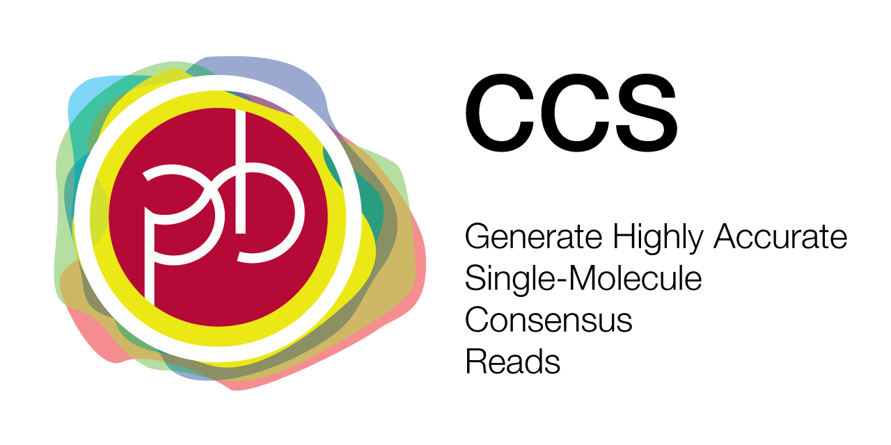
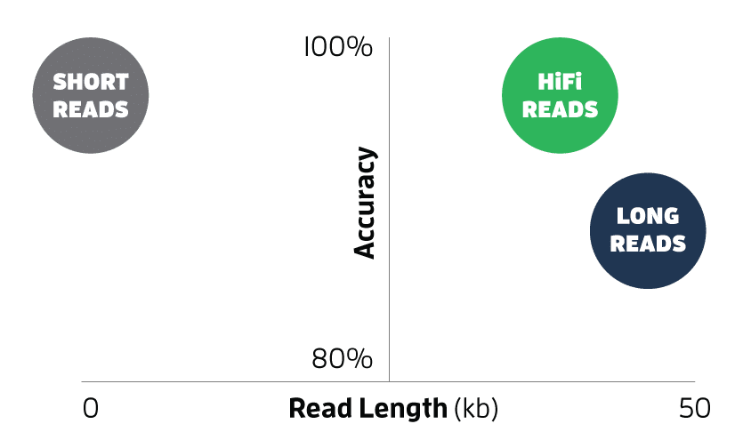
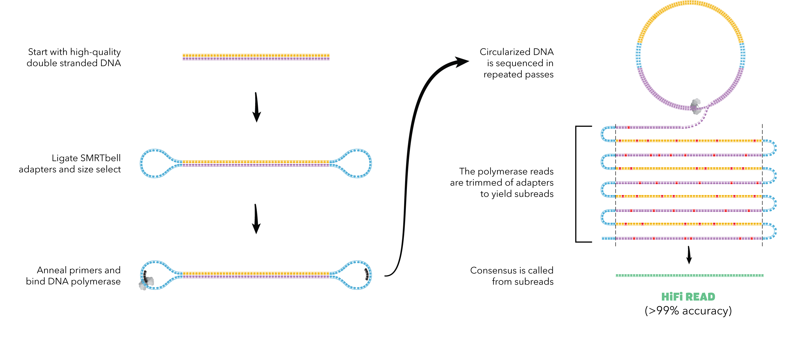

  

***

_ccs_ combines multiple subreads of the same SMRTbell molecule using a
statistical model to produce one highly accurate consensus sequence,
also called a HiFi read, along with base quality values.
This tool powers the _Circular Consensus Sequencing_ workflow in SMRT Link.

## A New Paradigm in Sequencing with HiFi Reads

Advanced scientific discoveries require sequencing data that is both accurate and complete. Single Molecule, Real-Time (SMRT) Sequencing technology has evolved to a different type of long read, known as highly accurate long reads, or HiFi reads.
PacBio is the only sequencing technology to offer HiFi reads that provide accuracy of >99.9%, on par with short reads and Sanger sequencing. With HiFi reads you no longer have to compromise long read lengths for high accuracy sequencing to address your toughest biological questions.

## Availability
The latest `ccs` can be installed via the bioconda package `pbccs`.

Please refer to our [official pbbioconda page](https://github.com/PacificBiosciences/pbbioconda)
for information on Installation, Support, License, Copyright, and Disclaimer.

## Latest Version
Version **6.3.0**: [Full changelog here](/changelog)

## Open position
[**Apply now!**](https://www.thegravityapp.com/shared/job?clientId=8a7882525cf735a1015d1e0affa16ff0&id=8a7887a878f52449017961e2b27a1844&u=1629497634&v=9&token=eyJ1aWQiOjMzMDQ0LCJwcm92aWRlciI6ImJvdW5jZSIsInR5cGUiOiJlbWFpbCJ9.tkiUIP-M0EtiHBfAg07lTu4Hlwc)
We are hiring a talented bioinformatician with sequence analysis roots and modern C++ experience.
Our global and full-time remote team will enable you to grow in this role.
Help us to better human health through genomics!

## What's new!
_ccs_ is now running on the Sequel IIe instrument, transferring HiFi reads
directly off the instrument.\
Read how _ccs_ works on [Sequel IIe](/faq/sqiie) and what is in the [`reads.bam` file](/faq/reads-bam)!

## Schematic Workflow

## Execution
**Input**: Subreads from a single movie in PacBio BAM format (`.subreads.bam`).

**Output**: Consensus reads in a format inferred from the file extension:
unaligned BAM (`.bam`); bgzipped FASTQ (`.fastq.gz`);
or SMRT Link XML (`.consensusreadset.xml`) which also generates a corresponding
unaligned BAM file.

Run on a full movie:

    ccs movie.subreads.bam movie.ccs.bam

Parallelize by using `--chunk`.
See [how-to chunk](/faq/parallelize).

Feel free to [make _ccs_ slightly faster via environment variables](/faq/performance#can-i-tune-performance-without-sacrificing-output-quality).
