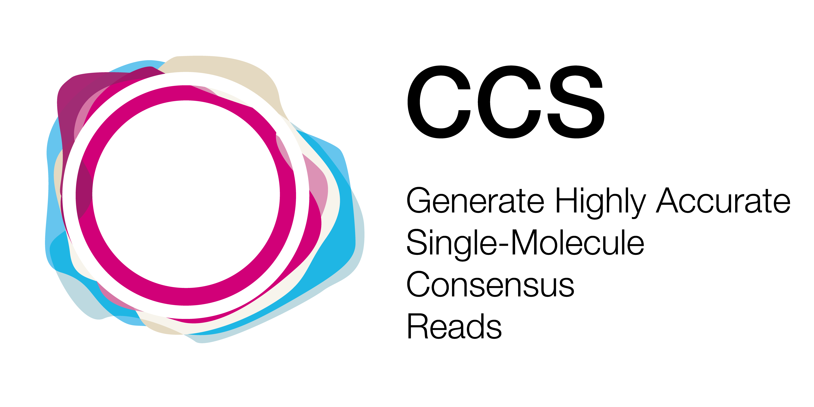
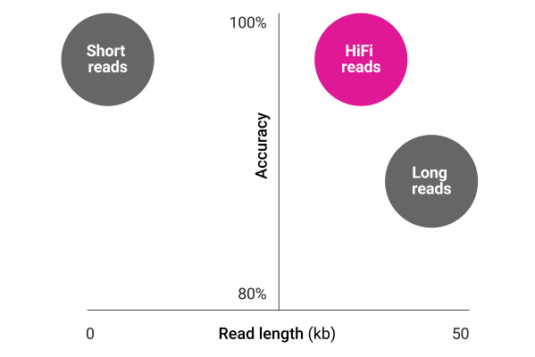

  

***

_ccs_ combines multiple subreads of the same SMRTbell molecule using a
statistical model to produce one highly accurate consensus sequence, also called
a HiFi read, along with base quality values. This tool powers the _Circular
Consensus Sequencing_ workflow in SMRT Link for Sequel and Sequel II platform.
On Sequel IIe and Revio platforms, HiFi generation is perfomed on the instrument.

## A New Paradigm in Sequencing with HiFi Reads

Advanced scientific discoveries require sequencing data that is both accurate
and complete. PacBio sequencing technology has evolved to a different type of
long read, known as highly accurate long reads, or HiFi reads.

PacBio is the only sequencing technology to offer HiFi reads that provide
accuracy of 99.9%, on par with short reads and Sanger sequencing. With HiFi
reads you no longer have to compromise long read lengths for high accuracy
sequencing to address your toughest biological questions.

## Availability
`ccs` version 6.4.0 for SQII can be installed via the bioconda package `pbccs`.

Please refer to our [official pbbioconda
page](https://github.com/PacificBiosciences/pbbioconda) for information on
Installation, Support, License, Copyright, and Disclaimer.

## Latest Version
Version **8.0.1**: [Full changelog here](/changelog)

## What's new!
 * [DeepConsensus is integrated into _ccs_ for the Revio platform](/faq/revio)
 * [Output BAM file compression](/faq/qv-binning)
 * [Add fail flag `ff`](/faq/fail-reads)

## Schematic Workflow

## Execution
**Input**: Subreads from a single movie in PacBio BAM format (`.subreads.bam`).

**Output**: Consensus reads in a format inferred from the file extension:
unaligned BAM (`.bam`); bgzipped FASTQ (`.fastq.gz`); or SMRT Link XML
(`.consensusreadset.xml`) which also generates a corresponding unaligned BAM
file.

Run on a full movie:

    ccs movie.subreads.bam movie.ccs.bam

Parallelize by using `--chunk`. See [how-to chunk](/faq/parallelize).

Feel free to [make _ccs_ slightly faster via environment
variables](/faq/performance#can-i-tune-performance-without-sacrificing-output-quality).
